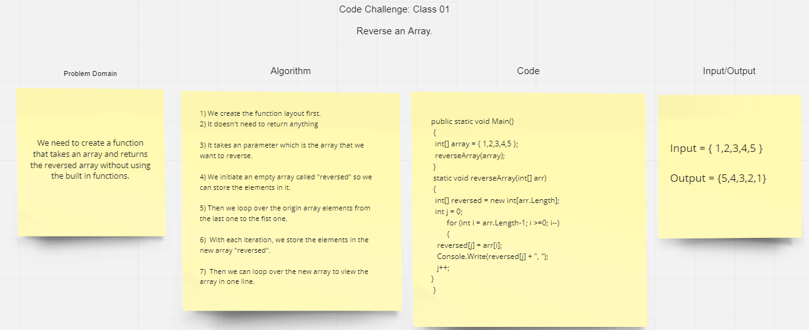

# Reverse an Array
Write a function called reverseArray which takes an array as an argument. Without utilizing any of the built-in methods available to your language, return an array with elements in reversed order.

## Whiteboard Process

## Approach & Efficiency
The approach that was made is by using a loop in order to move over the elements of the array.  The complexity is O(n), order-n. The time increases as the number of inputs N increases.