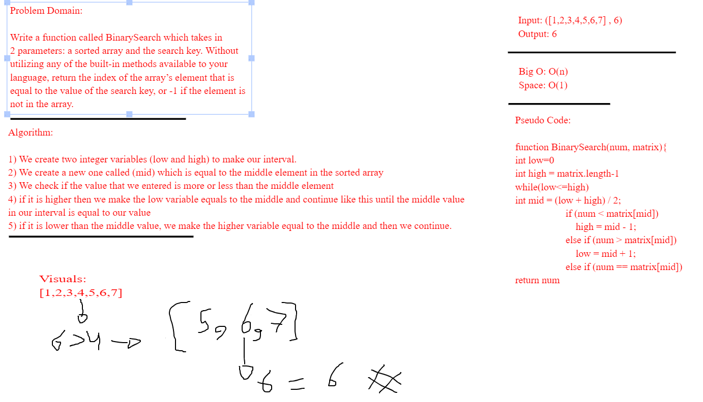
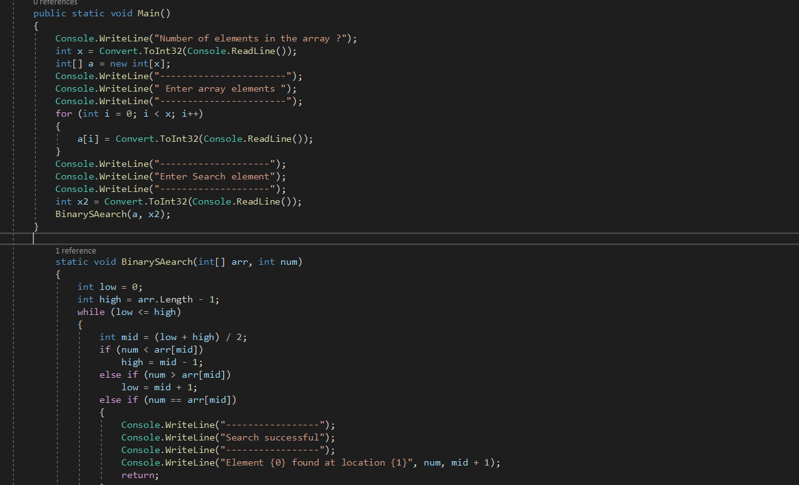

## Binary Search
Write a method called BinarySearch which takes in 2 parameters: a sorted array and the search key. Without utilizing any of the built-in methods available to your language, return the index of the array element that is equal to the search key, or -1 if the element does not exist.

## Whiteboard Process

## Code

## Approach and efficiency
The appraoch to solving this challenge is by looping over the sorted array and checking if our value is more or less than the middle element on our interval until the middle value equals our value that we want to check and for that the time efficiency will be O(n) since we are using just a loop and O(1) for space efficiency
