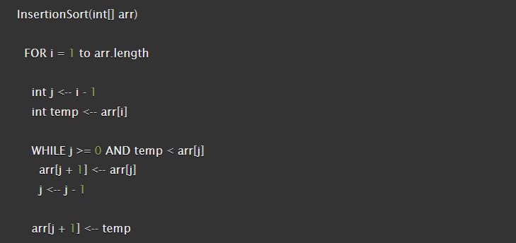
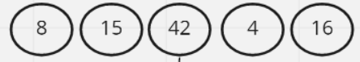
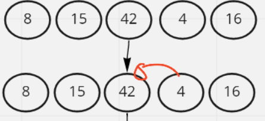
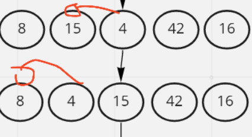
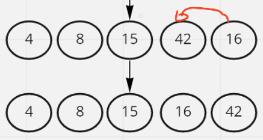

# Insertion Sort

Insertion sort is a simple sorting algorithm. The array is virtually split into a sorted and an unsorted part. Values from the unsorted part are picked and placed at the correct position in the sorted part.

 
 

## PsuedoCode

 
 

## Trace

Sample Array: [8,15,42,4,16]

### Pass One:

We start iteration through the array and comparing the first two elements, as we can see 8 and 15 are in thier correct spots for now.

### Pass Two:

We continue the iteration and check the elements two and three, also 15 and 42 are in their correct spots for now.

### Pass Three:

We continue the iteration and check the elements three and four, we can see that 42 and 4 are not in their correct spots and thus we have to replace their spots so they become 4 -> 42

### Pass Four:

We continue with the same process until 4 is in the first index of the array as it is supposed to be since it is smaller than the previous indexes.

### Pass Five:

We compare the last two indexes and see that 42 and 16 are not in the correct positions so we replace them so they become 16 -> 42

And the array is now sorted!

 
 

## Efficency

+ Time: O(n^2)
The basic operation of this algorithm is comparison. This will happen n * (n-1) number of times, concluding the algorithm to be n squared.

+ Space: O(1)
No additional space is being created. This array is being sorted in place, keeping the space at constant O(1).

