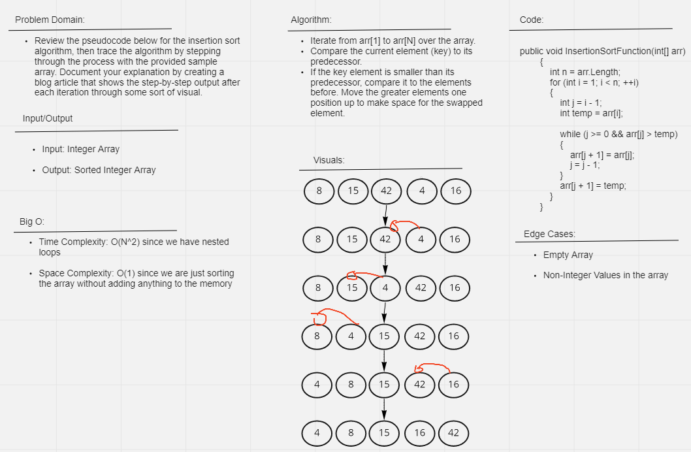

# Insertion Sort
Review the pseudocode below for the insertion sort, then trace the algorithm by stepping through the process with the provided sample array. Document your explanation by creating a blog article that shows the step-by-step output after each iteration through some sort of visual.

 
 

## WhiteBoard

 
 

## Approach and Efficiency

Time Complexity: O(N^2) since we have nested loops

Space Complexity: O(1) since we are just sorting the array without adding anything to the memory