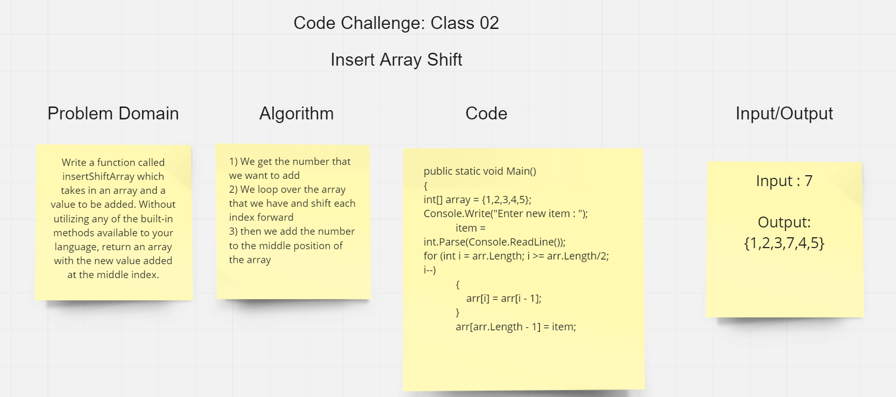

## Array-Insert-Shift
Write a function called insertShiftArray which takes in an array and a value to be added. Without utilizing any of the built-in methods available to your language, return an array with the new value added at the middle index.

## Whiteboard Process

## Approach & Efficiency
The approach that was made is by using a loop in order to move over the elements of the array.  The complexity is O(n), order-n. The time increases as the number of inputs N increases.