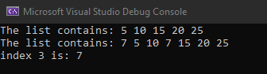

# Challenge Summary
For this challenge, finding the k'th element in the linked list from the last.

## Whiteboard Process

## Approach & Efficiency
The approach to each method was the same, we loop over the list until we find the place we want to return the element in the list.
the efficiency for this method since we use a while loop and the time complexity for that is O(n) and the space complixety is O(1).

## Solution
here we can see our output after the adding to the list.

