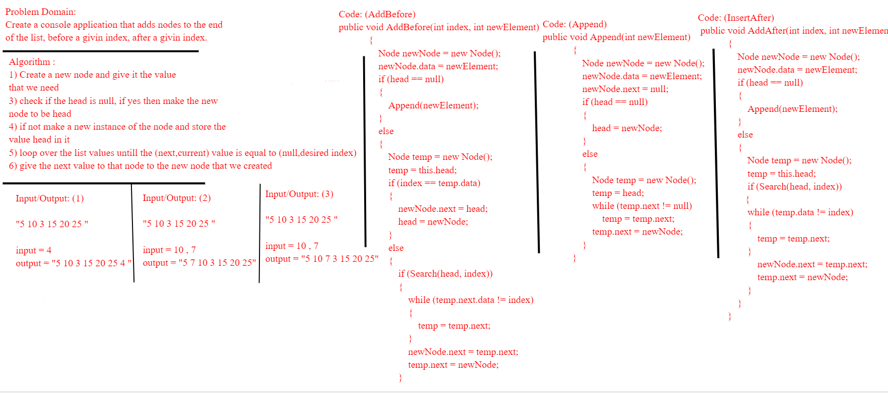
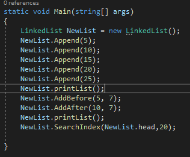
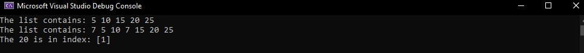

# Challenge Summary
For this challenge, insertation for the linked list were asked, insert at the end of the list, insert before a givin index and after a givin index

## Whiteboard Process

## Approach & Efficiency
The approach to each method was the same, we loop over the list until we find the place we want to insert our node at.
the efficiency is the same for all of the methods since we use a while loop and the time complexity for that is O(n) and the space complixety is O(1)./

## Solution
Here is our inputs.

here we can see our output after the adding to the list.

