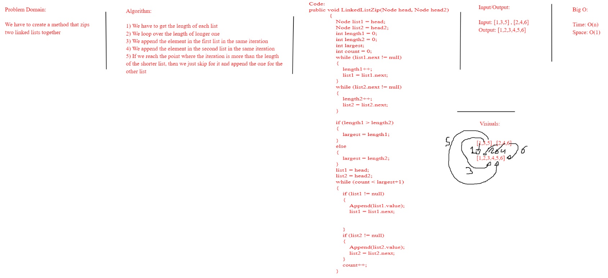
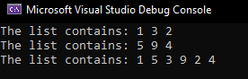

# Challenge Summary
For this challenge, we will have to zip two linked lists together

## Whiteboard Process

## Approach & Efficiency
The approach was to find the length of the two lists and find the longer one and loog over the length, with each iteration we append an element from the first list then append from the second one.
the efficiency for this method since we use a while loop and the time complexity for that is O(n) and the space complixety is O(1).

## Solution
here we can see our output after the adding to the list.

