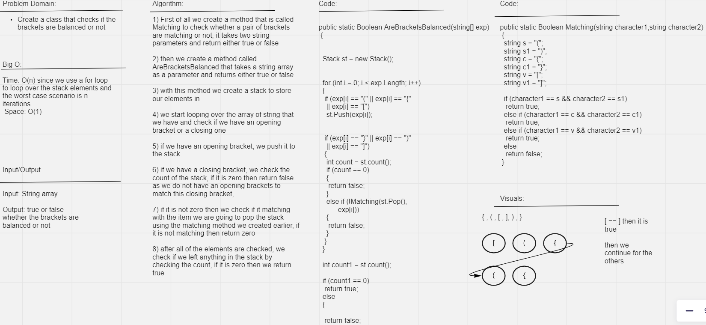

# Challenge Summary
For this challenge, we will have to validate if the brackets are balanced

## Whiteboard Process

## Approach & Efficiency
The approach was to loop over the array then create a stack and push the element if it is an opening bracket to the stack or if it is a closing bracket we check if it is matching to the opening bracket that was just pushed and that is by popping it out of the stack
the efficiency for this method since we use a while loop and the time complexity for that is O(n) and the space complixety is O(1).

