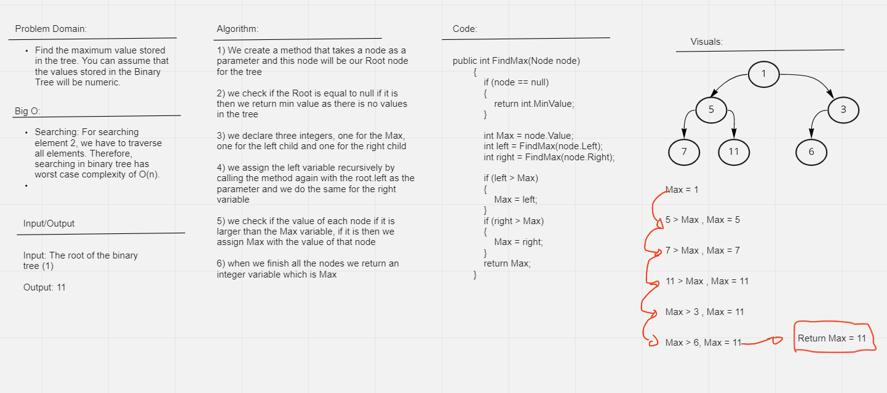

# Binary Tree Maximum 

## Problem Domain

Create a method that returns the maximum value in a binary tree

## Approach & Efficiency

Searching: For searching element , we have to traverse all elements. Therefore, searching in binary tree has worst case complexity of O(n).

Space O(1)

## Whiteboard

