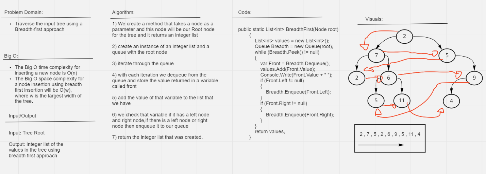

# Breadth First Traversal 

## Challenge 
Write a function called breadth first, that take arguments: tree and return: list of all values in the tree, in the order they were encountered

## WhiteBoard

