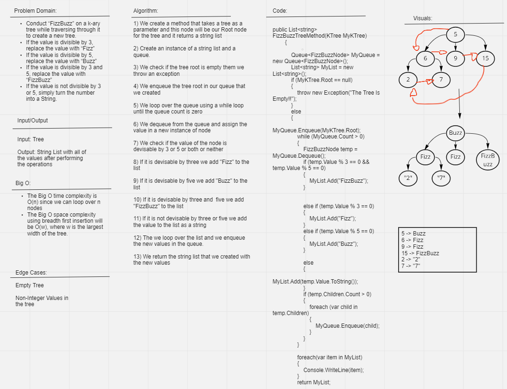

# FizzBuzz K-ary Tree 

## Problem Domain

Conduct “FizzBuzz” on a k-ary tree while traversing through it to create a new tree.

Set the values of each of the new nodes depending on the corresponding node value in the source tree.

## Approach & Efficiency

We loop over a queue with the values of the tree using the breadth first traversal and check if the value is devisable by either 3 or 5 or both or neither and depending on that we add Fizz/Buzz/FizzBuzz or the value of the element in the tree as a string to our list, then we loop over the list and enqueue all of the elements in it in the queue one more time

The Big O time complexity is O(n) since we can have n nodes to loop over

The Big O space complexity is O(w) where W is the largest width of the tree.

## Whiteboard

