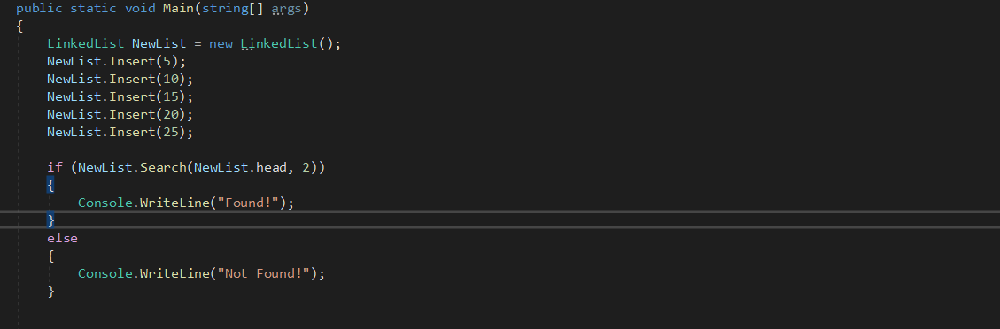
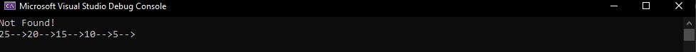

# Singly Linked List
Singly Linked List: It is the simplest type of linked list in which every node contains some data and a pointer to the next node of the same data type. The node contains a pointer to the next node means that the node stores the address of the next node in the sequence. 

## Challenge
We need to create a class named Node and a LinkedList class as well, the  LinkedList class has three methods, the first one is Insert which addes a new node at the beggining of the list, the second one prints the list, the third one checks if a certain value is in the list

## Approach & Efficiency

### Insert
The approach is by creatring a new instance of the Node class and store the value we want to add in it then putting the next value to be the current first value then giving the head value to the new added value.
The Insert method is of O(1) time efficiency and O(1) for space.

### Print
The Approach is by looping over the list starting by the head and with each iteration we print the value we currently have then we move to the next value.
The print is of O(n) time efficiency and O(1) for space.

### Search
The approach is by looping over the list values and using an if statement to check if the current value is equal to the value we are searching for.
the search is of O(n) time efficiency and O(1) for space.

## API

We start our application and insert a couple of numbers to it then we search for a value that is not in the list then we can see the printed list.

