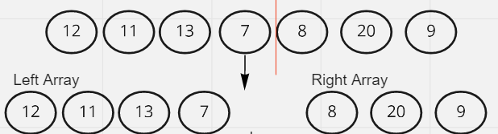
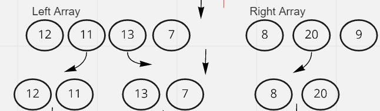
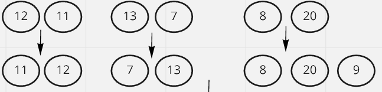
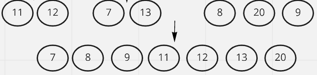

# Merge Sort

Merge Sort is an algorithm that divides the input array into two halves, calls itself for the two halves, and then it merges the two sorted halves.

 
 

## PsuedoCode

    ALGORITHM Mergesort(arr)
    DECLARE n <-- arr.length

    if n > 1
      DECLARE mid <-- n/2
      DECLARE left <-- arr[0...mid]
      DECLARE right <-- arr[mid...n]
      // sort the left side
      Mergesort(left)
      // sort the right side
      Mergesort(right)
      // merge the sorted left and right sides together
      Merge(left, right, arr)

    ALGORITHM Merge(left, right, arr)
    DECLARE i <-- 0
    DECLARE j <-- 0
    DECLARE k <-- 0

    while i < left.length && j < right.length
        if left[i] <= right[j]
            arr[k] <-- left[i]
            i <-- i + 1
        else
            arr[k] <-- right[j]
            j <-- j + 1

        k <-- k + 1

    if i = left.length
       set remaining entries in arr to remaining values in right
    else
       set remaining entries in arr to remaining values in left

 
 

## Trace

### First Pass 

We start by splitting the array into a left and right array 

### Second Pass

We recursively call the method one more time with the left array and the right array to make the array into smaller units

### Third Pass

We call the merge method that takes the two arrays which are the left and right arrays

## Fourth Pass 

We compare each two units together in the merge method so we can sort them

## Fifth Pass

After comparing all of them we add them into an array which will have all of the elements in an ascending order

 
 

## Efficency
 Time Complexity: O(nLog(n)) as tihs method always divides the array into two halves and takes linear time to merge two halves.

 Space Complexity: O(n) since we are creating two arrays and sorting them then merging them into a single array