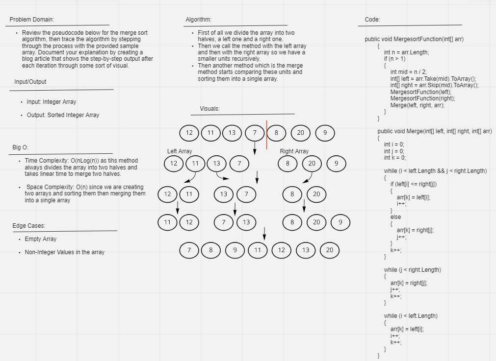

# Merge Sort

Merge Sort is an algorithm that divides the input array into two halves, calls itself for the two halves, and then it merges the two sorted halves.

## Whiteboard

## Approach and Efficiency

 Time Complexity: O(nLog(n)) as tihs method always divides the array into two halves and takes linear time to merge two halves.

 Space Complexity: O(n) since we are creating two arrays and sorting them then merging them into a single array