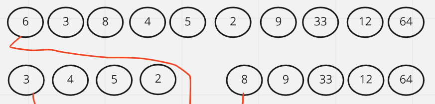
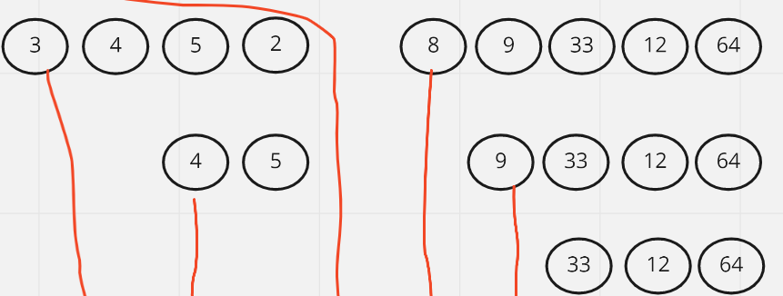
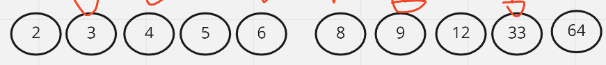

# Quick Sort

Quick sort is an algorithm that is based on the idea of choosing one element as a pivot and partitioning the array around the pivot with left side of the pivot containing all elements less than the pivot and right side of the pivot containing all elements greater than the pivot. 

 
 

## PsuedoCode

    ALGORITHM QuickSort(arr, left, right)
    if left < right
        // Partition the array by setting the position of the pivot value
        DEFINE position <-- Partition(arr, left, right)
        // Sort the left
        QuickSort(arr, left, position - 1)
        // Sort the right
        QuickSort(arr, position + 1, right)

    ALGORITHM Partition(arr, left, right)
    // set a pivot value as a point of reference
    DEFINE pivot <-- arr[right]
    // create a variable to track the largest index of numbers lower than the defined pivot
    DEFINE low <-- left - 1
    for i <- left to right do
        if arr[i] <= pivot
            low++
            Swap(arr, i, low)

     // place the value of the pivot location in the middle.
     // all numbers smaller than the pivot are on the left, larger on the right.
     Swap(arr, right, low + 1)
    // return the pivot index point
     return low + 1

    ALGORITHM Swap(arr, i, low)
    DEFINE temp;
    temp <-- arr[i]
    arr[i] <-- arr[low]
    arr[low] <-- temp

 
 

## Trace

### First Pass 

We start by selecting a pivot which will be the first element of the array in this case it will be 6, we split the array into two arrays a left one with numbers less than the pivot and the right with numbers more than the pivot 

### Second Pass

Then we take the pivot for the left and right arrays which will be three and also repeat the steps

### Final Result

 
 

## Efficency
 + Time Complexity: O(N²)
 + Space Complexity: O(1), since we are just sorting the same array without any additional space in the memory