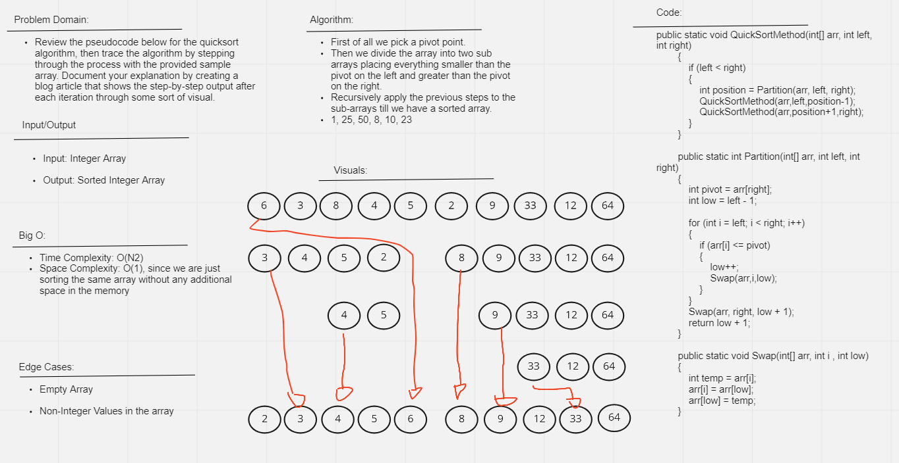

# ***QuickSort***

Quick Sort is a sorting algorithm that  takes a pivot element and places it in its correct position. Then the array to the left and right of the pivot element are again sorted using Quick Sort. This is done until the whole array is sorted.

## ***WhiteBoard***

## ***Approach and Efficiency*** 

+ Time Complexity: O(N²)
+ Space Complexity: O(1), since we are just sorting the same array without any additional space in the memory